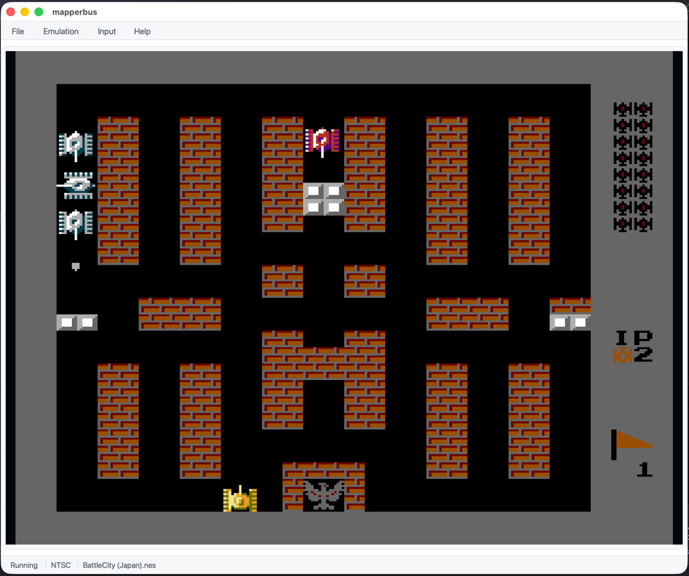

# MapperBus

[](LICENSE)
[](https://en.cppreference.com/w/cpp/23)
[](https://mesonbuild.com/)
[]()

A clean, extensible NES/Famicom emulator with FDS support, written in modern C++23.



## Features

### Emulation Core

- **CPU** -- MOS 6502 with unofficial opcodes, NMI/IRQ handling
- **PPU** -- Scanline-accurate rendering, sprites, sprite 0 hit, sprite overflow
- **APU** -- 5 channels, DMC stalling, LP/HP filters, BLEP resampling, ring buffer, DRC, HP-TPDF dithering, pseudo-stereo
- **FDS** -- Famicom Disk System with wavetable audio, envelope and modulation

### Supported Mappers

| #  | Name         | Expansion Audio |
|----|--------------|-----------------|
| 0  | NROM         |                 |
| 1  | MMC1         |                 |
| 2  | UxROM        |                 |
| 3  | CNROM        |                 |
| 4  | MMC3         |                 |
| 5  | MMC5         | Yes             |
| 7  | AxROM        |                 |
| 9  | MMC2         |                 |
| 11 | Color Dreams |                 |
| 19 | Namco 163    | Yes             |
| 24 | VRC6a        | Yes             |
| 26 | VRC6b        | Yes             |
| 69 | Sunsoft 5B   | Yes             |
| 85 | VRC7         | Yes             |

### Video Upscaling

- **xBRZ** -- CPU-based edge-smoothing upscaler (2x--6x)
- **xBRZ GPU** -- Metal compute shader accelerated xBRZ
- **FSR 1** -- CPU-based AMD FidelityFX Super Resolution
- **FSR 1 GPU** -- Metal compute shader EASU + RCAS pipeline with zero-copy presentation

### Audio Pipeline

- BlipBuffer band-limited resampling with Blackman-Nuttall windowed sinc (64-tap, 256 phases)
- Hardware-accurate or enhanced Butterworth filter chains
- NES and Famicom filter profiles
- Resistance-modeled expansion audio mixing
- Dynamic rate control for drift-free playback

### Region Support

Auto-detection via NES 2.0 header, CRC32 database, and filename heuristics. Manual override for NTSC, PAL, and Dendy.

### Input

- Keyboard: `Z` = B, `X` = A, right shift = Select, enter = Start, arrow keys = D-pad
- SDL3 gamepad: D-pad, Start, Back/Select, A on the east face button, B on the south face button
- Gamepad bindings can be changed from the SDL3 frontend command line
- The GUI Settings panel can configure keyboard and gamepad bindings, gamepad slot, deadzone, preview scale, UI density, and audio output settings
- Frontends share a universal `mapperbus.conf` file under the user configuration directory and restore supported settings on the next launch

## Building

### Requirements

- C++23 compiler (Clang 17+ or GCC 13+)
- [Meson](https://mesonbuild.com/) build system
- [just](https://github.com/casey/just) command runner (optional)
- SDL3 (fetched automatically via Meson wraps)

### Quick Start

```bash
just setup
just build
```

Or manually:

```bash
meson setup buildDir
meson compile -C buildDir
```

### Build Options

| Option               | Default | Description              |
|----------------------|---------|--------------------------|
| `enable_sdl3`        | `true`  | Build SDL3 frontend      |
| `enable_nodalkit_gui`| `false` | Build NodalKit GUI frontend |
| `enable_cli`         | `true`  | Build CLI frontend       |
| `enable_tests`       | `true`  | Build test suite         |

## Usage

```bash
# Standard
just run <rom.nes>

# With GPU xBRZ upscaling (2x-6x, default 3x)
just run-gpu <rom.nes> [scale]

# With GPU FSR 1 upscaling (2x-6x, default 4x)
just run-gpu-fsr <rom.nes> [scale]

# CPU xBRZ upscaling
just run-xbrz <rom.nes> [scale]

# Headless CLI
just run-cli <rom.nes>
```

SDL3 runtime scaler hotkeys:

- `0` or `1`: native scale
- `2`-`6`: switch to that scale factor immediately
- `F9`: cycle scaler mode for the active factor (`CPU xBRZ`, `CPU FSR`, `GPU xBRZ`, `GPU FSR`)
- `F5` / `F7`: save / load state (slot 0)
- `Shift+F5` / `Shift+F7`: save / load state (slot 1)
- `F11`: toggle fullscreen
- `V`: toggle vsync

### Full Options

```
mapperbus-sdl3 [options] <rom-file>

  --scale N             Upscale factor (2-6)
  --gpu                 GPU-accelerated xBRZ upscaling
  --gpu-fsr             GPU-accelerated FSR 1 upscaling
  --fsr                 CPU FSR 1 upscaling
  --sample-rate N       Audio sample rate (default: 96000)
  --resampling MODE     blip or cubic (default: blip)
  --filter-mode MODE    accurate, enhanced, or unfiltered (default: unfiltered)
  --filter-profile P    nes or famicom (default: nes)
  --region R            ntsc, pal, or dendy (default: auto)
  --stereo              Enable pseudo-stereo output
  --dither              Enable HP-TPDF dithering
  --expansion-mixing M  simple or resistance (default: simple)
  --gamepad N           SDL gamepad index (default: 0)
  --gamepad-deadzone N  Analog axis deadzone (default: 12000)
  --gamepad-map MAP     Comma-separated NES=SDL map
  --gamepad2 N          SDL gamepad index for player 2 (enables two-player)
  --gamepad2-map MAP    Player 2 gamepad mapping (same format as --gamepad-map)
```

Example gamepad remap:

```bash
mapperbus-sdl3 --gamepad-map a=east,b=south,up=lefty-,down=lefty+,left=leftx-,right=leftx+ <rom-file>
```

Gamepad controls use SDL names such as `a`, `b`, `x`, `y`, `start`, `back`, `dpup`, `dpdown`, `dpleft`, `dpright`, `leftshoulder`, `rightshoulder`, and axis directions such as `leftx-`, `leftx+`, `lefty-`, and `lefty+`.

### Two-Player Input

Player 1 defaults to keyboard. When `--gamepad2` is provided, a second gamepad drives player 2:

```bash
mapperbus-sdl3 --gamepad2 1 <rom-file>
```

### Configuration

MapperBus uses a frontend-neutral `mapperbus.conf` file:

```ini
[mapperbus]
format=mapperbus.conf
version=1

[frontend]
preview_scale=0
ui_density=0
audio_muted=false

[audio]
sample_rate=96000
buffer_size=2048
resampling=blip
filter_mode=unfiltered
filter_profile=nes
stereo=mono
dithering=false
expansion_mixing=simple

[input.keyboard]
up=82
down=81
left=80
right=79
a=27
b=29
start=40
select=229

[input.gamepad]
enabled=true
index=0
deadzone=12000
up=dpup
down=dpdown
left=dpleft
right=dpright
a=east
b=south
start=start
select=back
```

Default locations:

- macOS: `~/Library/Application Support/MapperBus/mapperbus.conf`
- Linux: `$XDG_CONFIG_HOME/mapperbus/mapperbus.conf` or `~/.config/mapperbus/mapperbus.conf`
- Windows: `%APPDATA%\MapperBus\mapperbus.conf`

## Testing

```bash
just test
```

Unit and integration suites cover bus logic, mappers, APU, audio pipeline, input mapping, configuration, region detection, emulation sessions, render integration, and synthesized CPU accuracy tests (opcode dispatch, flag behavior, unofficial opcodes).

## Project Structure

```
src/
  core/         # Emulation core (zero platform dependencies)
  platform/     # Platform abstraction interfaces
  frontends/    # SDL3, NodalKit GUI, and CLI implementations
  app/          # EmulationSession and composition root
tests/
  unit/         # Deterministic headless tests
  integration/  # ROM-based render tests
```

## License

This project is licensed under the MIT License -- see the [LICENSE](LICENSE) file for details.

## Author

Aleksandr Pavlov <ckidoz@gmail.com>
